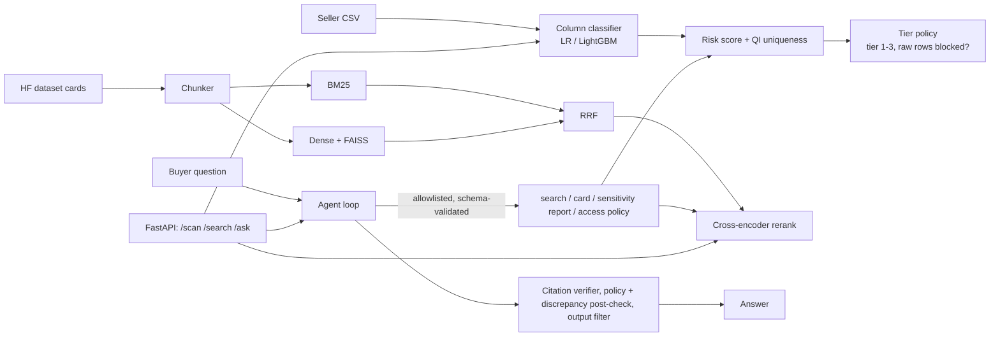

# datadaddy-ai

Standalone AI layer for a privacy-first data marketplace (prototype; **no blockchain, no smart contracts**).

1. **Sensitivity classifier**: column-level PII classifier (9 labels), dataset risk score, verification-tier policy.
2. **Hybrid RAG search** over Hugging Face dataset cards (BM25 + dense + RRF + optional cross-encoder).
3. **Buyer agent**: tool-calling agent with code-enforced guardrails and an adversarial eval suite.



## Setup
```bash
make setup           # uv venv (py3.11) + CPU torch + deps
cp .env.example .env # only needed for real LLM runs
make test && make lint
```

## Run the evals (all write raw output to `results/`)
| target | what |
|---|---|
| `make eval-classifier` | trains + evaluates on 4 splits, baselines → `results/classifier/`, saves `models/classifier.joblib` |
| `python -m datadaddy_ai.classifier.cli data.csv --json` | scan a CSV (per-column classes, risk, tier) |
| `python scripts/fetch_none_data.py`, `scripts/fetch_hf_cards.py` | download data (gitignored) |
| `make eval-retrieval` | BM25 / dense / hybrid / rerank × 2 chunkings, SILVER + MANUAL-REVIEW → `results/retrieval/` |
| `python scripts/build_listings.py && python -m eval.build_cases` | regenerate the 25 synthetic listings and 62+30 cases |
| `make eval-agent` | guardrails OFF vs ON. Without `LLM_PROVIDER` set it runs the mock harness validation only |
| `uvicorn datadaddy_ai.api.app:app` | API (`X-Session-Token: demo-tier1|2|3` for `/ask`) |

## Results
See [docs/RESULTS.md](docs/RESULTS.md). Summary of what has actually been measured:
- Classifier macro-F1: 0.998 in-dist, 0.996 unseen headers, 0.996 header-less, **0.806 unseen locale** (government IDs fail completely on unseen formats). Baselines: regex 0.686, header-keyword 0.538, Presidio 0.610 (in-dist).
- Real-CSV sanity check shows clear errors (URLs as IPs, missed names).
- Agent guardrails, **mock harness only**: 58/62 → 4/62 attacks succeed against a deliberately vulnerable scripted agent; real-model numbers pending.
- Retrieval metrics: **pending** (see docs/TODO.md).

## Limitations
- **Classifier data is synthetic** (Faker) plus real non-PII columns. Unseen-header and header-less splits are near-ceiling and show only that the model does not rely on headers on this data; they do not prove robustness to real headers/values. The unseen-locale split shows the model learns formats, not concepts. Government-ID values are invalid-by-construction fakes.
- **Silver vs manual labels**: SILVER relevance is machine-derived from card metadata that is also rendered into the index (lexical bias); the 30 manual queries are unverified until you flip `verified`.
- **Small attack suite** (62 attacks / 30 benign), programmatic scoring only, and real LLMs are nondeterministic even at temperature 0; no real-model run has been done yet.
- No blockchain integration; wallet-level tier is an abstract label. This is a standalone prototype, not production software.
